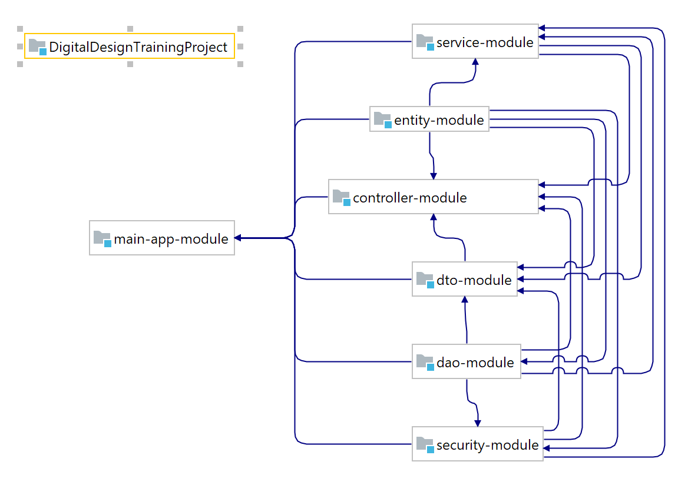

# DigitalDesignTrainingProject
My implementation of practice project from DigitalDesign.

## 

Do not forget change application.properties file variables to connect database.

*main-app-module/src/main/resources/application.properties:*

```properties
spring.datasource.url=
spring.datasource.username=
spring.datasource.password=
```

Also you can configure basic admin and basic user login and password.

*main-app-module/src/main/resources/init.properties:*

```properties
admin.login=admin
admin.password=admin

user.login=user
user.password=user
```

After successful deploy you can access *app.url/swagger-ui.html* for swagger-ui.

## Module separation


## Class diagram


## DataBase diaram

